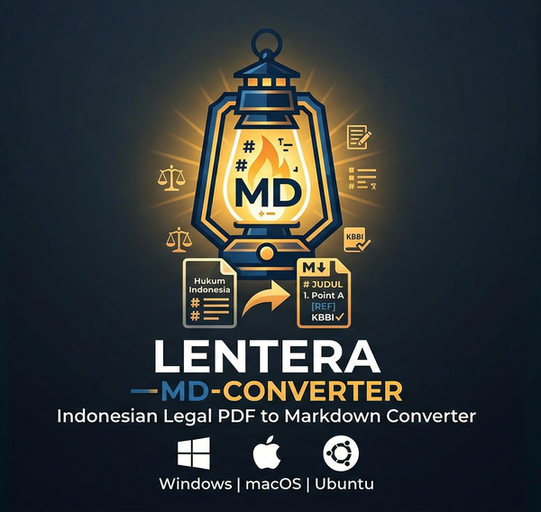

# Lentera MD




Aplikasi desktop *cross-platform* untuk mengonversi dokumen hukum Indonesia (PDF, DOCX, DOC, TXT, RTF) ke format Markdown, dilengkapi pemeriksaan ejaan berbasis KBBI.

> **Status:** ✅ Production Ready  
> **Dibangun dengan:** PySide6 (Qt6) · Docling (IBM) · RapidOCR · SQLite KBBI

---

## Fitur Utama

- **Multi-format:** Konversi PDF, DOCX, DOC, TXT, RTF ke Markdown
- **Drag & Drop:** Seret file langsung ke jendela aplikasi
- **Preview Dapat Diedit:** Lihat dan perbaiki hasil konversi langsung di panel preview
- **Pemeriksaan Ejaan KBBI:** 71.093 kata, klik typo → langsung navigasi ke posisi kata
- **Log Konversi Real-time:** Popup konversi menampilkan progres Docling secara live
- **Template Export:** 3 template bawaan (Hukum, Akademik, Dasar)
- **Kamus Pengguna:** Tambah kata domain-spesifik ke kamus personal (SQLite)
- **File Besar:** Pemrosesan terpotong untuk file >50 MB
- **Cross-Platform:** Windows, macOS, Linux dengan adapter native masing-masing

---

## Persyaratan

- Python 3.10 atau lebih tinggi
- PySide6 >= 6.6.0
- Docling >= 1.0.0
- PyTorch (versi CPU-only direkomendasikan)

---

## Instalasi

### Dari Sumber

```bash
# Clone repository
git clone https://github.com/ziffan/Lentera-MD-Converter
cd Lentera-MD-Converter

# Buat virtual environment
python -m venv venv
venv\Scripts\activate          # Windows
# source venv/bin/activate     # Linux / macOS

# Install PyTorch CPU-only (hindari unduh CUDA ~2 GB)
pip install torch --index-url https://download.pytorch.org/whl/cpu

# Install semua dependensi
pip install -e ".[dev]"

# Jalankan aplikasi
python src\legal_md_converter\main.py
```

> **Catatan pertama kali:** Docling akan mengunduh model OCR (~50–200 MB) saat pertama kali memproses PDF. Setelah itu berjalan offline dan jauh lebih cepat.

### Perbaiki torchvision jika perlu

```bash
# Jalankan hanya jika muncul: "operator torchvision::nms does not exist"
pip uninstall -y torchvision
pip install torchvision --index-url https://download.pytorch.org/whl/cpu
```

---

## Cara Penggunaan Cepat

1. Buka aplikasi → seret file PDF/DOCX/TXT ke panel kiri
2. Klik **Convert to Markdown** di toolbar atau menu Tools
3. Lihat hasil di panel kanan (bisa diedit langsung)
4. Klik **Save Markdown** (Ctrl+S) untuk menyimpan ke file

Lihat panduan lengkap di [HOW_TO_USE.md](HOW_TO_USE.md).

---

## Format yang Didukung

| Format | Ekstensi | Keterangan |
|--------|----------|------------|
| PDF | `.pdf` | Penuh (OCR via Docling + RapidOCR) |
| Word | `.docx`, `.doc` | Penuh (via Docling generic parser) |
| Rich Text | `.rtf` | Penuh |
| Plain Text | `.txt` | Penuh (native) |
| PowerPoint | `.pptx` | Didukung |
| Excel | `.xlsx` | Didukung |
| HTML | `.html` | Didukung |
| Markdown | `.md` | Didukung |

---

## Arsitektur

```
┌──────────────────────────────────────────────────────────┐
│  PRESENTATION: MainWindow, Preview, Dialog, Dock Widgets │
├──────────────────────────────────────────────────────────┤
│  BUSINESS LOGIC: DocumentService, SpellCheckEngine,      │
│                  MarkdownExporter                        │
├──────────────────────────────────────────────────────────┤
│  DATA: KBBI SQLite (71K kata), AssetManager,             │
│        UserDictionary, KBBISearcher (FTS5 + Bloom)      │
├──────────────────────────────────────────────────────────┤
│  PLATFORM: WindowsAdapter, MacOSAdapter, LinuxAdapter    │
└──────────────────────────────────────────────────────────┘
```

### Layer UI (PySide6)
- **MainWindow** — jendela utama: menu, toolbar, status bar, split view, dock widgets
- **FileDropWidget** — drag-and-drop berbasis QTreeWidget
- **DocumentPreview** — preview Markdown yang dapat diedit, dengan Ctrl+F, navigasi typo, replace inline
- **SpellCheckPanel** — daftar typo dengan tombol Ganti / Abaikan / Tambah ke Kamus
- **MarkdownPreview** — pratinjau Markdown dengan word count
- **ProgressDialog** — dialog progres thread-safe dengan log live Docling
- **AppTheme** — stylesheet Qt cross-platform

### Layer Engine
- **DocumentService** — koordinasi parsing, konversi, ekspor
- **DoclingParser** — parser PDF/TXT/DOCX dengan init async dan error handling
- **DocumentParserWorker** — QThread dengan progress signal + log capture real-time
- **MarkdownConverter** — eksporter Markdown dengan TemplateLoader (3 template)
- **SpellCheckEngine** — mesin ejaan KBBI dengan posisi karakter akurat
- **SpellCheckWorker** — worker chunk-based, posisi kata di teks asli (regex-based)

### Layer Data
- **KBBISearcher** — pencarian FTS5 + Bloom Filter (71.093 kata)
- **UserDictionary** — kamus pengguna persistent (SQLite)
- **AssetManager** — bundling asset lintas platform

---

## Struktur Proyek

```
Lentera-MD-Converter/
├── src/legal_md_converter/
│   ├── main.py                      # Entry point, high-DPI, icon runtime
│   ├── ui/
│   │   ├── main_window.py           # MainWindow (menu Save Markdown, About+links)
│   │   ├── widgets/
│   │   │   ├── document_preview.py  # Preview editable + navigate_to_position
│   │   │   ├── spellcheck_panel.py  # Panel ejaan
│   │   │   ├── progress_dialog.py   # Dialog progres + detail log live
│   │   │   ├── markdown_preview.py  # Pratinjau Markdown
│   │   │   ├── file_drop_widget.py  # Drag & drop
│   │   │   └── export_dialog.py
│   │   └── styles/app_theme.py
│   ├── engine/
│   │   ├── docling_parser.py
│   │   ├── document_parser_worker.py  # + log_message Signal
│   │   ├── document_service.py        # Default: Docling native markdown
│   │   ├── markdown_converter.py
│   │   ├── spell_checker.py
│   │   └── spell_check_worker.py      # Posisi kata berbasis regex
│   ├── data/
│   │   ├── kbbi_searcher.py
│   │   ├── kbbi_database.py
│   │   ├── asset_manager.py
│   │   └── user_dictionary.py
│   ├── platform/
│   │   ├── base_adapter.py
│   │   ├── windows_adapter.py
│   │   ├── macos_adapter.py
│   │   └── linux_adapter.py
│   └── utils/
│       ├── thread_worker.py
│       ├── path_utils.py
│       └── dependency_checker.py
├── assets/
│   ├── icons/
│   │   ├── app_icon.png    # 512×512 PNG (Linux + runtime)
│   │   ├── app_icon.ico    # Multi-size 16–256px (Windows)
│   │   └── app_icon.icns   # Multi-size 16–1024px (macOS)
│   ├── kbbi/
│   │   ├── kbbi.db         # Database KBBI (71.093 kata)
│   │   └── schema.sql
│   └── templates/
│       ├── legal.md
│       ├── academic.md
│       └── basic.md
├── tests/
│   ├── test_ui.py
│   ├── test_phase2.py
│   ├── test_phase3.py
│   └── test_phase4.py       # 65 tests, semua pass
├── pyproject.toml
├── LegalMDConverter.spec    # Icon Windows + macOS dikonfigurasi
├── build_app.py
├── build_macos.sh
├── build_debian.sh
├── HOW_TO_USE.md
└── README.md
```

---

## Pengembangan

### Menjalankan Tests

```bash
pytest tests/ -v
# Hasil: 65 passed
```

### Build Executable

```bash
# Windows / Linux (one-dir bundle)
python build_app.py

# macOS (DMG + codesign + notarize)
chmod +x build_macos.sh && ./build_macos.sh

# Debian/Ubuntu (.deb)
chmod +x build_debian.sh && ./build_debian.sh
```

---

## Performa

| Tahap | Hasil | Waktu |
|-------|-------|-------|
| Parse PDF (13.8 MB, 13 hal.) | ✅ | ~190 detik (pertama kali, unduh model) |
| Parse PDF (run berikutnya) | ✅ | ~15–30 detik |
| Konversi → Markdown | ✅ | <1 ms |
| Pemeriksaan ejaan (71K kata) | ✅ | ~12 detik (366 kata) |

---

## Troubleshooting

**torchvision CUDA error:**
```bash
pip uninstall -y torchvision
pip install torchvision --index-url https://download.pytorch.org/whl/cpu
```

**Parsing pertama kali lambat:** Docling mengunduh model AI (~50–200 MB). Tunggu hingga selesai; selanjutnya menggunakan cache.

**Spellcheck tidak jalan:** Pastikan file `assets/kbbi/kbbi.db` ada (±4.3 MB). Konversi dokumen harus selesai terlebih dahulu.

**Jendela tidak muncul (Linux Wayland):**
```bash
export QT_QPA_PLATFORM=wayland
python src/legal_md_converter/main.py
```

---

## Tautan

- **GitHub:** https://github.com/ziffan/Lentera-MD-Converter
- **Donasi Saweria:** https://saweria.co/kampusmerahdeveloper
- **Donasi Ko-fi:** https://ko-fi.com/kampusmerahdev


---

## Peringatan

Mohon periksa kembali hasil olah kata/kalimat sebelum digunakan. Jika dokumen bersumber dari hasil OCR, kemungkinan akan banyak tipo dan pemenggalan kata/kalimat yang tidak sesuai. Hasil di luar tanggung jawab pengembang. Terima kasih.

---

## Lisensi

MIT License — lihat file LICENSE untuk detail.

## Penghargaan

- [Docling](https://github.com/DS4SD/docling) (IBM) — mesin konversi dokumen
- [RapidOCR](https://github.com/RapidAI/RapidOCR) — mesin OCR
- [PySide6](https://www.qt.io/product/development-tools) — framework UI
- [KBBI](https://github.com/dyazincahya/KBBI-SQL-database) — basis data kamus Indonesia (71.093 kata)
